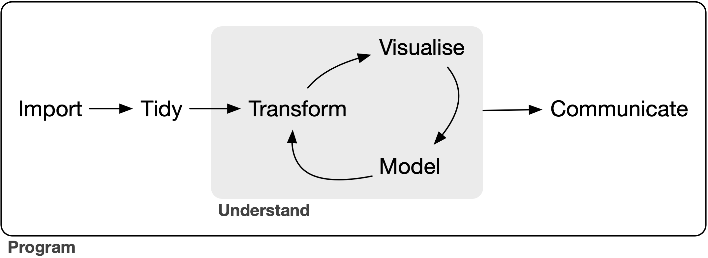

```{r echo=T, warning=F}
#Необходимые пакеты
library(readr)
library(tidyverse)
library(tidyr)
library(dplyr)
library(forcats)
library(flextable)
```

## Вселенная tidyverse

### Немного о данных

Основной набор данных -- из файла data_tsv.tsv, который лежит в директории data. Сейчас я загружу его в переменную data. Создастся датафрейм, с которым я преимущественно и буду работать.

```{r}
data <- read_tsv("data/data_tsv.tsv", col_names = T, show_col_types = T) #Разделитель (tab) "вшит" по умолчанию в эту версию утилиты read_delim
    data$Группа <- factor(data$Группа)
    data$Пол <- factor(data$Пол)
    data$`Группа крови` <- factor(data$`Группа крови`, levels = c("A (II)", "B (III)", "O (I)", "AB (IV)"))
```

### Философия tidyverse

В одной картинке.



### Пайп \|\>

В редакторе Positron стандартный пайп можно вставить сочетанием [Cmd+Shift+M]{style="background-color:lightblue"} (в Windows и Linux Ctrl+Shift+M).

### Импорт данных

Пакеты для чтения данных:

- readr (read_delim, read_tsv, read_csv, read_csv2),

- readxl (\*.xlsx, \*.xls),

- haven (SAS, SPSS).

Возвращают tibble – улучшенный датафрейм.

### Приведение в порядок и преобразование

1.  `mutate()` — изменяет столбцы, добавляет новые;

2.  `select()` — выбирает столбцы;

3.  `filter()` — фильтрует строки по условиям;

4.  `summarise()` — вычисляет сводные статистики;

5.  `arrange()` — сортирует строки;

6.  `group_by()` — группирует по значениям столбцов.

### Визуализация и коммуникация

- ggplot2 – красивые многослойные картинки,

- ggpubr – то же самое, но с готовыми функциями (расширяет функционал ggplot2),

- flextable – таблицы, которые нестыдно печатать в журналах и отчётах.

## Импорт данных

Общая функция – `read_delim()`, тип разделителя задаётся эксплицитно. В частных функциях `read_csv()`, `read_csv2()`, `read_tsv()` разделитель задаётся по умолчанию типом файла.

`write_delim()` – функция для записи данных из датафрейма в файл.

### Импорт из Excel и экспорт в Excel

Часто используемые пакеты: openxlsx, readxl.

```{r eval=F}
readxl::read_excel("data/data_excel.xlsx", sheet = "data") # Чтение из файла
openxlsx::write.xlsx(data, "out/data_excel.xlsx", colNames = TRUE) # Запись в файл
```

### R, SAS, SPSS

Rds – формат данных R. Функции `read_rds()` и `write_rds()`.

```{r eval=F}
read_rds("data/data_rds.rds")
write_rds(data, file="data/data_rds.rds")
```

### Добавление столбцов и строк

В tibble можно добавлять столбцы и строки следующими функциями:

- `add_column()`,

- `add_row()`.

`row_number()` – нумерация строк.

```{r warning=F}
data |>
  add_column(just_column = "just values", .before = 1) |>
  slice(1:3)

data |>
  add_row(Группа = "New group", Возраст = 100, .before = 1) |>
  slice(1:3)

data |>
  mutate(ID = row_number()) |>
  select(ID, everything()) |>
  slice(1:3)
```

## Преобразование данных

### Выбор столбцов

```{r}
data |> select(`Группа крови`, `Рост`)

data |> select(starts_with("б"))
data |> select(contains("_E1"))
data |> select(matches("_E\\d{1}"))

data |> select(where(is.numeric))
data |> select(where(function(x) is.numeric(x) && mean(x, na.rm = TRUE) > 10))

variables <- c("Базофилы_E1", "Эозинофилы_E1", "Гемоглобин_E1")
data |> select(all_of(variables))

variables_missing <- c(variables, "Имя отсутствующей переменной")
data |> select(any_of(variables_missing))

data |> select(`Группа`, starts_with("Гемоглобин"))
data |> select(!where(is.numeric))
```

### Перестановка и переименование столбцов

```{r}
data |> select(`Пол`, `Эритроциты_E1`, everything())

data |> relocate(contains("Эритроциты"), .after = `Группа крови`)

data |>
  select(
    `Эритроциты1` = `Эритроциты_E1`,
    `Эритроциты2` = `Эритроциты_E2`
  )

data |>
  rename(
    `Эритроциты1` = `Эритроциты_E1`,
    `Эритроциты2` = `Эритроциты_E2`
  )
```

### Выбор строк

```{r}
data |> slice(c(1, 3, 5))

data |> slice(-c(1, 3, 5))

data |> slice_head(n = 4)

data |> slice_tail(prop = 0.08)

data |> slice_sample(prop = 0.05)

data |> slice_min(`Возраст`)
```

### Фильтрация строк

```{r}
data |> filter(`Пол` == "Женский")

data |>
  filter(`Группа крови` %in% c("A (II)", "O (I)") & `Группа` != "Группа 1")

data |> filter(between(`Возраст`, 31, 34))

data |> filter(near(Эозинофилы_E1, 3.38, tol = 0.1))

data |> filter(if_all(.cols = contains("Базофилы"), .fns = function(x) x > 1.5))

data |> filter(if_any(.cols = contains("Базофилы"), .fns = function(x) x > 1.5))
```

### Сортировка

```{r}
data |> arrange(`Возраст`)

data |> arrange(`Группа крови`)

data |> arrange(desc(`Рост`))

data |> arrange(desc(`Рост`), `Возраст`)
```

### Группировка

```{r}
data |> filter(`Возраст` > mean(`Возраст`))

data |>
  group_by(`Группа`) |>
  filter(`Возраст` > mean(`Возраст`))

data |>
  group_by(`Группа`) |>
  arrange(`Возраст`, .by_group = TRUE)

data |> group_by(`Группа`) |> ungroup()
```

### Создание и изменение столбцов

```{r}
tibble(var_1 = 1:10, var_2 = var_1 + 1.123) |>
  mutate(
    var_sum = var_1 + var_2,
    var_minus = var_1 - var_2,
    var_multiple = var_1 * var_2,
    var_divide = var_1 / var_2,
    var_1_log = log(var_1),
    var_1_log1p = log1p(var_1),
    var_1_exp = exp(var_1_log),
    var_1_exm1 = expm1(var_1_log1p),
    var_2_round = round(var_2, 2),
    var_2_ceil = ceiling(var_2),
    var_2_floor = floor(var_2)
  )

data |>
  mutate(
    `Женщины с четвёртой группой крови` = if_else(
      `Пол` == "Женский" & `Группа крови` == "AB (IV)",
      "Да",
      "Нет"
    )
  ) |>
  select(`Женщины с четвёртой группой крови`, everything()) |>
  arrange(`Женщины с четвёртой группой крови`)

data |>
  mutate(
    `Возрастная группа` = case_when(
      `Возраст` < 20 ~ "< 20",
      between(`Возраст`, 20, 30) ~ "20 - 30",
      `Возраст` > 30 ~ "> 30"
    ),
    `Возрастная группа` = factor(
      `Возрастная группа`,
      levels = c("< 20", "20 - 30", "> 30")
    )
  ) |>
  select(`Возраст`, `Возрастная группа`)
```

```{r}
data |>
  mutate(across(where(is.numeric), function(x) {
    (x - mean(x, na.rm = TRUE)) / sd(x, na.rm = TRUE)
  }))

data |>
  mutate(across(contains("E1"), function(x) {
    (x - mean(x, na.rm = TRUE)) / sd(x, na.rm = TRUE)
  }))

data |>
  mutate(across(
    where(function(x) is.numeric(x) && mean(x, na.rm = TRUE) < 10),
    function(x) (x - mean(x, na.rm = TRUE)) / sd(x, na.rm = TRUE)
  ))

data |>
  group_by(`Группа`) |>
  mutate(across(contains("Базофилы"), function(x) x - mean(x, na.rm = TRUE))) |>
  ungroup() |>
  select(`Группа`, contains("Базофилы"))

data |> mutate(`Группа` = NULL)
```

### **Работа с пропущенными значениями**

```{r}
data |>
  mutate(
    `Базофилы_E1` = if_else(
      is.na(`Базофилы_E1`),
      mean(`Базофилы_E1`, na.rm = TRUE),
      `Базофилы_E1`
    )
  )

data |>
  mutate(
    `Группа крови` = as.character(`Группа крови`),
    `Группа крови` = replace_na(`Группа крови`, "Нет данных")
  )

data |>
  mutate(`Группа крови` = fct_na_value_to_level(`Группа крови`, "Нет данных"))

data |>
  mutate(`Группа крови` = na_if(`Группа крови`, "B (III)"))

data |>
  mutate(
    `Группа крови` = fct_na_level_to_value(
      `Группа крови`,
      extra_levels = "B (III)"
    )
  )
```

### **Расчёт статистик**

```{r}
data |>
  select(`Группа`, where(is.numeric)) |>
  group_by(`Группа`) |>
  summarise(across(where(is.numeric), function(x) mean(x, na.rm = TRUE)))

statistics <- list(
  `Количество субъектов` = ~ length(.x),
  `Количество (есть данные)` = ~ sum(!is.na(.x)),
  `Нет данных` = ~ sum(is.na(.x)),
  `Ср. знач.` = ~ mean(.x, na.rm = TRUE),
  `Станд. отклон.` = ~ sd(.x, na.rm = TRUE),
  `мин.` = ~ min(.x, na.rm = TRUE),
  `макс.` = ~ max(.x, na.rm = TRUE),
  `Медиана` = ~ median(.x, na.rm = TRUE),
  `Q1` = ~ quantile(.x, 0.25, na.rm = TRUE),
  `Q3` = ~ quantile(.x, 0.75, na.rm = TRUE)
)

data |>
  select(`Группа`, where(is.numeric)) |>
  group_by(`Группа`) |>
  summarise(across(where(is.numeric), statistics, .names = "{.col}__{.fn}")) |>
  mutate(across(-`Группа`, function(x) round(x, 2))) |>
  mutate(across(-`Группа`, as.character)) |>
  mutate(across(-`Группа`, function(x) replace_na(x, "Н/П*"))) |>
  pivot_longer(!`Группа`) |>
  separate(name, into = c("Переменная", "Статистика"), sep = "__") |>
  rename(`Значение` = value)

data |>
  group_by(`Группа`) |>
  summarise(n = length(na.omit(`Группа крови`)))

data |>
  select(`Группа`, where(is.factor)) |>
  mutate(
    `Группа крови` = fct_na_value_to_level(`Группа крови`, "Нет данных")
  ) |>
  count(`Группа`, `Группа крови`) |>
  group_by(`Группа`) |>
  mutate(`Процент по группе` = n / sum(n) * 100) |>
  ungroup() |>
  mutate(`Процент по выборке` = n / sum(n) * 100) |>
  mutate(across(starts_with("Процент"), function(x) str_c(round(x, 2), "%")))

data |> distinct(`Группа`, .keep_all = TRUE)             
```

### **Разделение и склеивание столбцов**

```{r}
tibble(var = "first part__second_part") |>
  separate(var, into = c("var_1", "var_2"), sep = "__")

tibble(var = "first part__second_part") |>
  separate(var, into = c("var_1", "var_2"), sep = "__") |>
  unite("new_var", var_1, var_2, sep = " AND ")
```

### **Объединение данных**

```{r}
set.seed(1)

data_1 <- tibble(var_1 = 1:10, var_2 = rep(c("Группа 1", "Группа 2"), 5))
data_2 <- tibble(var_2 = runif(10, 0, 1), var_3 = rnorm(10))
data_3 <- tibble(var_4 = 100:91, var_5 = rep(c("Молодые", "Средний возраст"), 5))

data_1 |>
  bind_cols(data_2) |>
  bind_cols(data_3)

data_1 <- tibble(var_1 = "var 1", var_2 = "var 2", var_3 = "var 3")
data_2 <- tibble(var_1 = "var 1", var_2 = "var 2")
data_3 <- tibble(var_1 = "var 1", var_2 = "var 2")

data_1 |>
  bind_rows(data_2) |>
  bind_rows(data_3)
```

### **Соединение по ключу**

```{r}
data_1 <- tibble(var_1 = 1:8) |>
  mutate(id = row_number())

data_2 <- tibble(var_2 = LETTERS) |>
  mutate(`Subject ID` = row_number()) |>
  slice(-1)

data_1
data_2

data_1 |>
  left_join(data_2, by = c("id" = "Subject ID"))

data_1 |>
  right_join(data_2, by = c("id" = "Subject ID"))

data_1 |>
  inner_join(data_2, by = c("id" = "Subject ID"))

data_1 |>
  full_join(data_2, by = c("id" = "Subject ID"))
```

### **Широкий и длинный формат**

```{r}
data |>
  select(Группа, contains("E1")) |>
  mutate(ID = row_number()) |>
  pivot_longer(!c(Группа, ID))

data |>
  select(Группа, contains("E1")) |>
  mutate(ID = row_number()) |>
  pivot_longer(!c(Группа, ID)) |>
  pivot_wider(id_cols = c(ID, Группа))
```

### **Массовое переименование**

```{r}
data |>
  rename_with(function(x) str_replace_all(x, c("_E1" = "1", "_E2" = "2")))

data |>
  rename_with(.cols = where(is.numeric), .fn = function(x) str_c(x, " КОЛИЧЕСТВЕННАЯ ПЕРЕМЕННАЯ"))
```

## Таблицы flextable

### **Создание таблицы из датафрейма**

```{r}
data <- read_tsv("data/data_tsv.tsv", show_col_types = FALSE)
data$Группа <- factor(data$Группа)
data$Пол <- factor(data$Пол)
data$`Группа крови` <- factor(
  data$`Группа крови`,
  levels = c("O (I)", "A (II)", "B (III)", "AB (IV)")
)

statistics <- list(
  `Количество субъектов` = ~ length(.x),
  `Количество (есть данные)` = ~ sum(!is.na(.x)),
  `Нет данных` = ~ sum(is.na(.x)),
  `Ср. знач.` = ~ mean(.x, na.rm = TRUE),
  `Станд. отклон.` = ~ sd(.x, na.rm = TRUE),
  `мин.` = ~ min(.x, na.rm = TRUE),
  `макс.` = ~ max(.x, na.rm = TRUE),
  `Медиана` = ~ median(.x, na.rm = TRUE),
  `Q1` = ~ quantile(.x, 0.25, na.rm = TRUE),
  `Q3` = ~ quantile(.x, 0.75, na.rm = TRUE)
)

table <- data |>
  select(`Группа`, where(is.numeric)) |>
  group_by(`Группа`) |>
  summarise(across(where(is.numeric), statistics, .names = "{.col}__{.fn}")) |>
  mutate(across(-`Группа`, function(x) round(x, 2))) |>
  mutate(across(-`Группа`, as.character)) |>
  mutate(across(-`Группа`, function(x) replace_na(x, "Н/П*"))) |>
  pivot_longer(!`Группа`) |>
  separate(name, into = c("Переменная", "Статистика"), sep = "__") |>
  rename(`Значение` = value)

table |>
  as_flextable() #Чтобы полностью вывести таблицу, используйте flextable()
```

### **Тема таблицы**

```{r}
table |>
  as_flextable() |>
  theme_box()
```

### **Объединение ячеек**

```{r}
table |>
  as_flextable() |>
  theme_box() |>
  merge_v(c("Группа", "Переменная"))

tibble(var_1 = c("p-value", "0.001"),
       var_2 = c("p-value", "0.05")) |>
  flextable() |>
  theme_box() |>
  merge_h(i = 1)
```

### **Выравнивание текста**

```{r}
table <- tibble(`Adverse events` = c("SOC Желудочно-кишечные нарушения 10017947",
                                     "PT Тошнота 10028813",
                                     "SOC Нарушения со стороны нервной системы 10029205",
                                     "PT Головная боль 10019211"))

table |>
  flextable() |>
  theme_box() |>
  align(align = "center", part = "all")

table |>
  flextable() |>
  theme_box() |>
  align(i = ~ str_detect(`Adverse events`, "SOC"), align = "left") |>
  align(i = ~ str_detect(`Adverse events`, "PT"), align = "right") |>
  width(width = 2)
```

### **Жирный и курсивный текст**

```{r}
table <- tibble(`Adverse events` = c("SOC Желудочно-кишечные нарушения 10017947",
                                     "PT Тошнота 10028813",
                                     "SOC Нарушения со стороны нервной системы 10029205",
                                     "PT Головная боль 10019211"))

table |>
  flextable() |>
  theme_box() |>
  align(i = ~ str_detect(`Adverse events`, "SOC"), align = "left") |>
  align(i = ~ str_detect(`Adverse events`, "PT"), align = "right") |>
  bold(i = ~ str_detect(`Adverse events`, "SOC")) |>
  italic(i = ~ str_detect(`Adverse events`, "PT")) |>
  width(width = 2)
```

### **Цвет текста и ячеек**

```{r}
is_pvalue_sign <- function(x) {
  as.numeric(str_remove(x, "<")) <= 0.05
}

table <- tibble("p-value" = c("<0.001", "0.38", "0.124", "0.005", "0.05"))

table |>
  flextable() |>
  theme_box() |>
  color(i = ~ is_pvalue_sign(`p-value`), color = "orange")

table |>
  flextable() |>
  theme_box() |>
  bg(i = ~ is_pvalue_sign(`p-value`), bg = "orange")
```